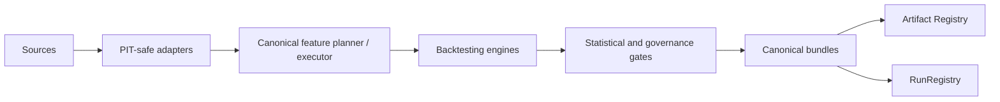
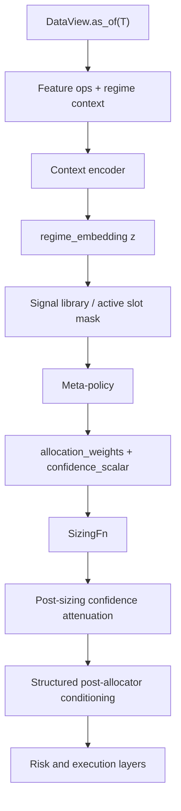

# MarketMind README

<!-- MM:BEGIN:TITLEPAGE -->
Version 7.2.3 · April 2026 · Proprietary

Companion documents: Implementation Plan v6.5.10 · Technical Roadmap v1.4.31 · Meta-Learning Core v1.2.25 · Meta-Learning Architecture Vision v1.3.6 · Resolution Ledger v1.0.52 · VERSION.md 7.2.3
<!-- MM:END:TITLEPAGE -->

<!-- MM:BEGIN:DOCBODY -->

## Table of Contents

- [1. Overview](#1-overview)
  - [1.1 North Star](#11-north-star)
  - [1.2 What Exists Today](#12-what-exists-today)
  - [1.3 What Is Still Experimental](#13-what-is-still-experimental)
- [2. Working Pipeline](#2-working-pipeline)
- [3. System Skeleton](#3-system-skeleton)
  - [3.1 Current Architecture](#31-current-architecture)
  - [3.2 Proposed Meta-Learning Runtime](#32-proposed-meta-learning-runtime)
  - [3.3 Why the Allocator Is Not Yet the Product](#33-why-the-allocator-is-not-yet-the-product)
- [4. Architecture Overview](#4-architecture-overview)
  - [4.1 Key Architectural Ideas](#41-key-architectural-ideas)
  - [4.2 Operational Guarantees](#42-operational-guarantees)
  - [4.3 Validation-First Meta-Learning Framing](#43-validation-first-meta-learning-framing)
- [5. Getting Started](#5-getting-started)
  - [5.1 Run the Current Pipeline](#51-run-the-current-pipeline)
  - [5.2 Common Tasks](#52-common-tasks)
  - [5.3 Main Source Areas](#53-main-source-areas)
  - [5.4 Practical Repo Truth](#54-practical-repo-truth)
- [6. Quality, Testing, and Governance](#6-quality-testing-and-governance)
  - [6.1 Testing Standards](#61-testing-standards)
  - [6.2 Promotion Mindset](#62-promotion-mindset)
- [7. Companion Documents](#7-companion-documents)
- [8. Canonical Release Ledger](#8-canonical-release-ledger)

# 1. Overview

MarketMind is a production-minded algorithmic trading research and execution system built around one durable thesis: markets are non-stationary, so long-lived edge comes from maintaining many weak, diverse signals and recombining them as regimes shift.

The current platform already provides the governed substrate required to test that thesis honestly: point-in-time data handling, leakage-aware validation, deterministic artifacts, statistical gatekeeping, and canonical bundle provenance. What it does **not** yet provide is a proven meta-learning allocator. That allocator is the intended future system center of gravity, but it remains a governed hypothesis under validation rather than a subsystem the project is pretending to have already earned.

This distinction matters. MarketMind is not trying to win by hand-waving around “AI for trading.” It is trying to build a system that can:

- produce auditable research artifacts,
- reject weak or non-reproducible results,
- preserve point-in-time correctness,
- and only promote more adaptive machinery when it actually beats simpler alternatives under realistic constraints.

The companion documents frame the project around a few core questions:

- **Architectural claim:** a meta-learning allocator is the preferred architecture for adaptive signal recombination across regime-indexed, non-exchangeable market tasks.
- **Null hypothesis:** a simpler regime-conditioned baseline can match or exceed the proposed allocator once cost, robustness, and operational burden are counted.
- **Five claims to prove:** task non-exchangeability, adaptation usefulness, encoder coherence, proxy alignment, and continual robustness.
- **Promotion boundary:** the allocator is promoted only if it beats the relevant baseline and satisfies the required empirical acceptance criteria.
- **Kill boundary:** the adaptive-learning path is abandoned if the simpler system wins or the required evidence does not materialize.

That gives the repo a cleaner identity: the current product is the governed research substrate, while the adaptive allocator is the product candidate.

## 1.1 North Star

The long-term system vision still has three primitives:

| Primitive | Role | Current State |
|---|---|---|
| Signal Factory | Governed engine that creates, catalogs, screens, promotes, and retires candidate signals and strategy slices | Partially implemented through `StrategyRegistry`, SignalCatalog substrate, screening artifacts, and governed strategy slices |
| Regime-Indexed Curriculum | Historical task distribution built from regime-bounded episodes with support/query semantics and crisis-aware holdouts | Specified in companion docs; canonical task identity, regime vocabulary, and confidence-contract slices exist in code, while the full curriculum runtime still remains ahead |
| Meta-Policy Allocator | Adaptive allocation layer that emits `allocation_weights` and `confidence_scalar` across the active signal set | Specified and validation-gated, not yet implemented |

Those primitives still define the system skeleton, but they no longer imply implementation maturity. Only the substrate portions that truly exist today are described as delivered.

## 1.2 What Exists Today

The implemented platform is strongest where research truthfulness matters most. MarketMind already has:

- a canonical bundle-producing orchestration path,
- point-in-time-safe data access on the governed path,
- governed feature execution through a canonical planner / executor route,
- artifact registry identity and run-state management,
- **II-0A complete**: WS-1 froze the strict-H3 RG-09 reference anchor, WS-2 delivered the task-validity diagnostic, and WS-3 registered the integrated `ALL_PASS` task-validity report after CI confirmation,
- **II-0B complete on the non-promotable artifact-and-contract lane**: the governed artifact triple carries required non-recursive `content_hash` blocks, the ML evidence shell re-checks artifact-level semantics and surfaces threshold-governance summaries, canonical `pysrc/pipeline` orchestration now fails closed unless governed II-0B evidence is structurally usable under `phase2_ii0b_governed_non_promotable/`, borrowed `THR-RG09-V03` / `THR-RG09-V17` references are framed as reviewer-visible lineage rather than native orchestration policy, and stale pre-hash root triples are explicitly retired from current governed evidence,
- **II-0C non-promotable pilot harness**: the pilot / dry-run path exercises canonical MetaTask scaffolding, a deterministic reference-only encoder stub, XGBoost incumbent comparison plumbing, and II-0C wrapper metadata through the unchanged governed II-0B artifact lane; both entrypoints fail closed on task-identity drift, baseline/shared parity drift, or extra keys inside governed `baseline_comparison`; research-only shells `ii0c_pilot_report.json` and `ii0c_dry_run_summary.json` record reviewer-visible semantics (dry-run also dual-writes `phase2_ii0c_scaffold_non_promotable.json` for path-based collectors) without claiming promotable Phase II evidence,
- governed strategy slices such as `stat_arb_pairs` and momentum work,
- screening, statistical-validity, and execution-assumptions artifact surfaces,
- leakage-aware tests, determinism discipline, and CI gates,
- and companion documents that separate current truth from future intent.

In other words, the repo already has serious infrastructure. What is missing is not basic engineering hygiene. What is missing is the evidence required to justify a more ambitious allocator.

## 1.3 What Is Still Experimental

Several important ideas are intentionally still treated as unearned:

- the meta-learning allocator itself,
- encoder-driven task adaptation,
- advanced uncertainty-aware routing behavior,
- execution-serious deployment layers,
- and broad signal-factory automation at scale.

The project is deliberately structured so those remain future-facing until the evidence says otherwise.

Phase II-0B remains scaffolding rather than allocator readiness even after closure of the artifact-and-contract lane. Its current value is that later Phase II evidence is more auditable, reproducible, and fail-closed at the canonical orchestration layer; the borrowed RG-09 threshold references on this lane are reviewer-visibility lineage only, not native orchestration policy. It does not authorize trainer commitment, allocator promotion, broker wiring, or execution-serious rollout.

Phase II-0C is a **complete non-promotable pilot harness** (research wiring and reviewer shells only). It preserves **GATE-II DEFERRED**, keeps the XGBoost incumbent as the comparison baseline, uses the existing governed II-0B evidence lane without a second artifact path, and ships a frozen reference input bundle for drift replay. It does not prove encoder quality, trainer readiness, allocator superiority, or promotable Phase II behavior.

# 2. Working Pipeline

The current governed platform is already useful because a single command can produce an auditable bundle:

```bash
python -m pysrc.bridge.java_entry tests/fixtures/sample_spy.csv --fast-sma 5 --slow-sma 10
```

Representative outputs include:

- `plan.json` for run configuration and plan identity
- `env_fingerprint.json` for interpreter, git, system, and dependency evidence
- `dataset_manifest.json` for data provenance and lineage
- `cleaning_plan.json` for normalized governed cleaning specs, step identity, determinism tier, and registry fingerprint
- `cleaning_report.json` for executed cleaning steps, mutation summaries, validation outcomes, and fallback events
- `preprocessing_report.json` for pipeline diagnostics
- `splits_manifest.json` for train/test split details
- `gate_result.json` for PASS / FAIL reasoning

That is a meaningful product surface by itself. The platform can already emit evidence-rich bundles, not just backtest output.

# 3. System Skeleton

## 3.1 Current Architecture

Today, the real platform is best summarized as:



That path is the trusted substrate on which later adaptive-learning work must be built. It is already meaningful on its own because it enforces lineage, policy, and current-state truthfulness.

## 3.2 Proposed Meta-Learning Runtime

If the empirical program succeeds, the intended runtime shape becomes:



Several points matter here:

- `MetaTask` is the canonical learning unit, not “strategy” or “signal.”
- `regime_id` is the primary high-granularity task identity, while `regime_class` is the coarser projection used for curriculum and reporting.
- `theta_meta`, `theta_task_prime`, and `theta_day_prime` are distinct lifecycle objects and should not be collapsed casually in prose or code.
- Dynamic signal coverage uses fixed-slot masking so replay, gating, and promotion remain comparable.
- `confidence_scalar` defaults to post-sizing attenuation rather than magical control over the whole system.

## 3.3 Why the Allocator Is Not Yet the Product

The allocator is the intended product candidate, but not the current product reality.

Today’s value is the governed research substrate:

- it can produce trustworthy bundles,
- it can prevent obvious leakage and provenance failures,
- it can enforce policy on governed strategy slices,
- and it can tell the team whether a future allocator actually deserves promotion.

That “tell the truth before scaling up” posture is one of MarketMind’s core differentiators.

# 4. Architecture Overview

## 4.1 Key Architectural Ideas

Several platform ideas remain important even before the adaptive-learning stack exists:

- **Registry-driven plugin pipelines.** Cleaning, feature, strategy, and validation surfaces are composed through typed registries rather than ad hoc wiring.
- **Single front-door orchestration.** `py.pipeline.orchestrator` owns governed run order, identity, manifests, and artifact stitching while stage packages own their own execution runtimes.
- **Functional core / imperative shell.** Strategy logic and feature transforms are pushed toward pure computation while I/O, clocks, broker interaction, and mutable execution state stay outside that core.
- **Canonical IR pipeline.** The long-term target remains a staged pipeline from MarketData → Features → Alpha → Targets → Orders → Fills → Ledger.
- **Artifact provenance.** Canonical hashing and immutable artifact identity ensure promotion claims can be reconstructed and audited.
- **Multi-fidelity validation.** Lower-cost research paths should graduate to higher-fidelity evaluation only when transfer evidence justifies it.

## 4.2 Operational Guarantees

These guarantees remain non-negotiable regardless of the final allocator:

- **Point-in-time correctness:** all mutable data access must respect `DataView.as_of(T)`.
- **Determinism tiers:** governance-sensitive outputs require explicit determinism contracts.
- **Artifact provenance:** promoted runs must be reconstructible from canonical bundle artifacts.
- **Statistical rigor:** DSR, PBO, Harvey-style evidence, and Anti-Goodhart discipline are part of the promotion story.
- **No silent fallbacks:** failures on governed paths should fail closed with actionable diagnostics.

## 4.3 Validation-First Meta-Learning Framing

The proposed adaptive-learning design is not just “adaptive weighting with fancier names.” It changes the unit of learning and therefore the type of evidence required:

- tasks are regime-bounded episodes with support / query semantics,
- encoder quality becomes a first-class validation topic,
- inner-loop gain must be demonstrated rather than assumed,
- proxy alignment must be tested because the training loss is not identical to the reporting metric,
- and continual-learning controls must preserve robustness rather than merely enable frequent updates.

# 5. Getting Started

## 5.1 Run the Current Pipeline

```bash
python -m pysrc.bridge.java_entry tests/fixtures/sample_spy.csv --fast-sma 5 --slow-sma 10
```

## 5.2 Common Tasks

```bash
pytest tests/python/
```

```bash
mypy pysrc/
```

```bash
python -m pysrc.cli.gate validate <bundle_dir>
```

## 5.3 Main Source Areas

| Path | Purpose |
|---|---|
| `pysrc/artifact_registry/` | Canonical CAS storage and RunRegistry |
| `pysrc/backtesting/` | Engines, validation, storage/report seams |
| `pysrc/cli/` | Gate CLI and related entrypoints |
| `pysrc/pipeline/` | Canonical orchestration and stage execution |
| `pysrc/registry/` | SignalCatalog and screening/report substrate |
| `pysrc/strategies/` | Governed strategy implementations and registry surfaces |
| `tests/python/` | Unit, integration, and property tests |
| `docs/src/` | Markdown source for the companion suite |

## 5.4 Practical Repo Truth

The codebase is substantially more mature than an “experimental trading repo” description would suggest. There is already real work in:

- strategy registration and governed bundle production,
- artifact registry identity and run state management,
- splits, purge / embargo discipline, and leakage-focused property testing,
- statistical validity and execution assumptions on the canonical gate path,
- and the beginning of governed signal-identity infrastructure through SignalCatalog and `slot_index`.

The main missing pieces are not basic engineering hygiene. They are the adaptive-learning stack, broader execution scope, and the evidence required to justify either of those expansions.

# 6. Quality, Testing, and Governance

## 6.1 Testing Standards

- New tests must carry determinism tier markers (`d0`–`d3`).
- Randomized tests must use the deterministic seed fixture rather than ad hoc seeding.
- The suite expects strict typing, precise exception handling, and no debug `print()` in production code.
- Governance-sensitive outputs should aim for D0 or clearly justified D1 / D2 behavior depending on artifact type.

## 6.2 Promotion Mindset

MarketMind’s governance model is built around a few recurring questions:

1. Is the artifact or model **truthful** about current implementation state?
2. Is the result **reproducible** from canonical inputs and artifacts?
3. Has it **beaten the relevant baseline** under realistic constraints rather than by narrative force?
4. If it fails, do the artifacts make rollback or kill decisions straightforward?

That mindset applies equally to runtime code, gate policy, and documentation.

# 7. Companion Documents

This README is the suite entrypoint, not the full specification.

- **README.md** — suite entrypoint, practical repo truth, current-state framing, and navigation
- **Implementation Plan** — executable implementation path, deliverables, and gate structure
- **Technical Roadmap** — strategic build order and dependency-aware roadmap
- **Meta-Learning Core** — empirical validation program and acceptance hierarchy
- **Meta-Learning Architecture Vision** — runtime shape, interfaces, and validation-gated defaults
- **Resolution Ledger** — workflow state, normative locks, and decision tracking

<!-- MM:BEGIN:DOCMAP -->

| Document | Version | Role |
|---|---:|---|
| README.md | 7.2.3 | Suite overview, current status, and navigation |
| Implementation Plan | 6.5.10 | Executable implementation path, deliverables, and phase gates |
| Technical Roadmap | 1.4.31 | Strategic build order and dependency-aware roadmap |
| Meta-Learning Core | 1.2.25 | Research supplement defining task schema, inner/outer loop mechanics, curriculum, and acceptance criteria |
| Meta-Learning Architecture Vision | 1.3.6 | High-level architectural vision and system framing |
| Resolution Ledger | 1.0.52 | Resolution ledger and workflow state dashboard |
| VERSION.md | 7.2.3 | Canonical release ledger |

<!-- MM:END:DOCMAP -->

# 8. Canonical Release Ledger

Release history and release manifests live in `VERSION.md` and `docs/releases/`. This README stays focused on current system behavior and companion-document roles.

<!-- MM:END:DOCBODY -->
