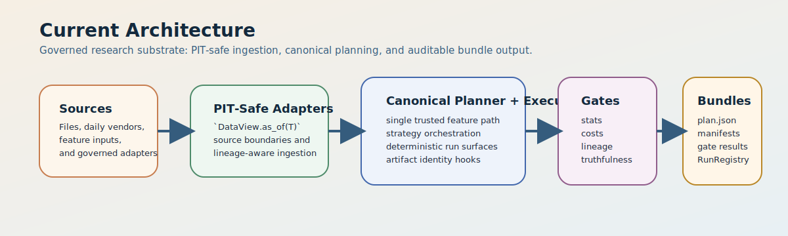
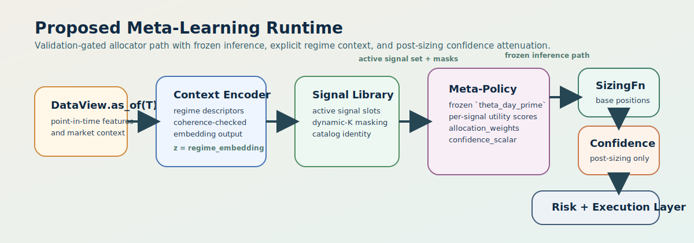

**MarketMind**

────────────────────────────────

**Algorithmic Trading Platform**

README & Technical Overview

<!-- MM:BEGIN:TITLEPAGE -->
Version 4.18.12 · April 2026 · Proprietary

Companion documents: Implementation Plan v6.4.32 · Technical Roadmap v1.4.21 · Meta-Learning Core v1.2.19 · Meta-Learning Architecture Vision v1.2.20 · Resolution Ledger v1.0.40 · VERSION.md 4.18.28
<!-- MM:END:TITLEPAGE -->

<!-- MM:BEGIN:DOCBODY -->

## Table of Contents

- [1. Overview](#1-overview)
  - [1.1 North Star](#11-north-star)
  - [1.2 Strategic Pillars](#12-strategic-pillars)
  - [1.3 What Works Today](#13-what-works-today)
  - [1.4 What Is Planned](#14-what-is-planned)
  - [1.5 Core Document Split](#15-core-document-split)
- [2. Current Status & Roadmap](#2-current-status--roadmap)
  - [2.1 What Works vs What Does Not Yet Exist](#21-what-works-vs-what-does-not-yet-exist)
  - [2.2 Phase View](#22-phase-view)
  - [2.3 Working Pipeline](#23-working-pipeline)
- [3. System Skeleton](#3-system-skeleton)
  - [3.1 Current Architecture](#31-current-architecture)
  - [3.2 Proposed Meta-Learning Runtime](#32-proposed-meta-learning-runtime)
  - [3.3 Why the Allocator Is Not Yet the Product](#33-why-the-allocator-is-not-yet-the-product)
- [4. Architecture Overview](#4-architecture-overview)
  - [4.1 Key Architectural Ideas](#41-key-architectural-ideas)
  - [4.2 Operational Guarantees](#42-operational-guarantees)

# 1. Overview

MarketMind is a production-minded algorithmic trading research and execution system built around one durable thesis: markets are non-stationary, so long-lived edge comes from maintaining many weak, diverse signals and recombining them as regimes shift. The current platform already provides the governed substrate required to test that thesis honestly: point-in-time data handling, leakage-aware validation, deterministic artifacts, statistical gatekeeping, and canonical bundle provenance. What it does **not** yet provide is a proven meta-learning allocator. That allocator is the intended future system center of gravity, but it remains a governed hypothesis under validation rather than a subsystem the project is pretending to have already earned.

This distinction is now explicit across the companion suite. The revised Meta-Learning Core and Meta-Learning Architecture Vision establish a new framing:

- **Architectural claim:** a meta-learning allocator is the preferred architecture for adaptive signal recombination across regime-indexed, non-exchangeable market tasks.
- **Null hypothesis:** a simpler regime-conditioned XGBoost allocator matches or exceeds the proposed architecture once cost, robustness, and operational burden are counted.
- **Five claims to prove:** task non-exchangeability, adaptation usefulness, encoder coherence, proxy alignment, and continual robustness.
- **Promotion boundary:** the architecture is promoted only if it beats the baseline and satisfies the full empirical acceptance hierarchy.
- **Kill boundary:** the program is abandoned if the baseline wins, adaptation fails to add statistically meaningful value, embeddings remain incoherent, or held-out crisis generalization fails.

The result is a documentation suite that is intentionally more disciplined than the earlier “Phase II is the obvious next build” framing. MarketMind still aims at a Meta-Policy Allocator, but only through a validation-first path that is willing to let the simpler system win.

The roadmap now makes the pre-build foundation explicit. Phase I-F closes truthfulness and interface seams. Phase I-G freezes the research world, policy, and proof burden. Phase II-0 builds only the minimum non-promotable harnesses needed to test those decisions honestly. Phase II is the first phase allowed to build promotable adaptive-learning machinery.

## 1.1 North Star

The long-term product vision still has three primitives:

| Primitive | Role | Current State |
|---|---|---|
| Signal Factory | Governed engine that creates, versions, screens, promotes, and retires candidate signals and strategy slices | Partially implemented through `StrategyRegistry`, SignalCatalog substrate, screening artifacts, and governed strategy slices |
| Regime-Indexed Curriculum | Historical task distribution built from regime-bounded episodes with support/query semantics and crisis-aware holdouts | Specified in v2.0 docs, not yet implemented |
| Meta-Policy Allocator | Adaptive allocation layer that emits `allocation_weights` and `confidence_scalar` across the active signal set | Specified and validation-gated, not yet implemented |

Those primitives still define the system skeleton, but they no longer imply implementation maturity. Only the substrate portions that truly exist today are described as delivered.

## 1.2 Strategic Pillars

The following design pillars remain non-negotiable whether the final promoted allocator is a meta-learner or the simpler baseline:

1. **Meta-policy as product candidate.** Signals and strategies are raw material; the durable product thesis is adaptive recombination, not any single standalone alpha.
2. **Governance first.** No signal, model, or allocator update is promoted without reproducible evidence and fail-closed gates.
3. **Constraint-aware portfolio construction.** Cost, turnover, and risk realism are part of the truth criterion, not optional overlays.
4. **Regime-indexed adaptation.** Tasks are regime episodes, not IID samples; if adaptation cannot be measured safely under that structure, the architecture should not be promoted.
5. **Breadth at scale.** A governed platform prefers many weak, diverse edges over a few brittle ones, with lifecycle controls to retire decay rather than narrate around it.
6. **Operational trust.** Point-in-time correctness, determinism tiers, and artifact lineage are required for any claim that matters.
7. **Execution realism.** Execution assumptions are part of the governed artifact set; anything that only works with unrealistic fills or zero costs is not considered a working result.

## 1.3 What Works Today

The implemented platform is strongest where research truthfulness matters most. Companion and ledger truth are current through **`VERSION.md` 4.18.28**; the Phase I-F-2 planning-surface milestone remains **4.9.0**, and Phase I-E engineering delivery remains anchored at **`4.5.4`** in the version ledger. MarketMind already has:

- a canonical bundle-producing orchestration path,
- PIT-safe daily source adaptation on the governed path,
- governed single-path feature execution through the canonical planner/executor route,
- a live governed `stat_arb_pairs` vertical slice,
- a materially advanced governed momentum substrate,
- SignalCatalog with stable `slot_index` identity,
- governed `screening_report.json`, `execution_assumptions.json`, and `stat_validity_report.json` artifacts,
- DataLineageGate and artifact-registry-owned hashing/canonicalization boundaries,
- reconstructible bundle lineage through the canonical artifact registry,
- and a mature Python testing stack with determinism tiers, leakage/property tests, strict typing, and CI discipline.

That is already a meaningful product substrate. It means MarketMind can generate truthful artifacts about strategy behavior and gate decisions today. It does **not** mean the system already has a validated meta-policy allocator, production live execution stack, or empirical evidence that the v2.0 architecture beats the simpler baseline.

## 1.4 What Is Planned

The remaining roadmap is intentionally ordered by evidence:

1. Finish Phase I-F honestly.
2. Freeze research protocols and proof burden in Phase I-G.
3. Build non-promotable harnesses in Phase II-0.
4. Build only the justified parts of Phase II.
5. Keep Phases III and IV conditional.

> **Guardrail.**  
> Phase I-F freezes system truth.  
> Phase I-G freezes research policy, protocols, and proof burden.  
> Phase II-0 implements only the minimum scaffolding needed to test those decisions honestly.  
> Phase II is the first phase allowed to build promotable adaptive-learning machinery.  
> Phase III is the first phase allowed to become execution-serious.  
> Phase IV is the first phase allowed to become signal-factory-serious.  
> Neither I-G nor II-0 may quietly become full Phase II.

## 1.5 Core Document Split

The v2.0 suite deliberately splits the meta-learning topic across two source-of-truth documents:

- **Meta-Learning Core** owns empirical proof burden, workstreams, acceptance hierarchy, failure playbooks, threshold handling, and promotion/rollback/kill rules.
- **Meta-Learning Architecture Vision** owns runtime shape, interfaces, invariants, and validation-gated defaults.

If the two documents appear to disagree, Core governs on evidence and proof requirements while Architecture Vision governs on interface shape and non-negotiable runtime contracts.

# 2. Current Status & Roadmap

> **Release docs workflow.** For any release version `X.Y.Z`, the canonical end-to-end entrypoint for building and verifying the DOCX suite is:
>
> ```powershell
> .\docs\release-docs.ps1 all X.Y.Z
> ```

**Current release context:** `VERSION.md` is at **4.18.28**. The earlier unsuccessful RG-09 surfaces remain true and still matter: the historical H1 transition base with fixture `sha256:07b28854ab30099bbe548ea77ec677122290c9412b6f451bd88fdb8ed781bfa9` remained `NEEDS_MORE_EVIDENCE / FAIL_NONREPRODUCIBLE`; H4 at `runs/rg09_h4_market_class_risk` stayed a non-reproducible failed rescue on the narrowed `ES,NQ,RTY,YM,SPY,HYG,VIX` basket; and proper H2 at `runs/rg09_h2_cross_sectional` removed the non-reproducibility failure mode but still remained below threshold statistically on a reproducible surface. The new authoritative learning is the executed H3 strict successor surface at `runs/rg09_h3_granularity`: `vol_window = 120`, `trend_flat_epsilon = 0.01`, `vol_bucket_method = quintile`, `crisis_vol_score_percentile = 95.0`, fixture `sha256:d38639a4f2cb8be5e0c57cd1fdaa3750b8a26336b93dd907a6b0f2b9d289e11c`, `decision = PASS`, `decision_reason = "All required RG-09 evidence families passed."`, `reproducibility_consistent = true`, `fail_codes = []`, and `trainer_commitment_unlocked = true`, with both folds passing overall/statistical/structural/functional lanes and **86 admissible episodes**. A nearby H3 p85 sensitivity control failed kill with `FAIL_EXCHANGEABLE_TASKS` on the same admissible-episode count (**86**), with `crisis rows = 12903` and `high_vol rows = 0`, which is why the current docs now say the strict p95 successor surface rescued RG-09 as a promotable path under the tested H3 neighborhood rather than treating the line as dead. The strongest supported lesson is careful rather than sweeping: within the tested H3 neighborhood, crisis-label strictness appears to be the decisive lever because the passing p95 surface preserved crisis/high_vol separation while the looser p85 surface collapsed high_vol into crisis. The docs also keep the limitation explicit: the attached evidence does not fully isolate whether `vol_window = 120` and `trend_flat_epsilon = 0.01` are individually necessary. Because the emitted harness still uses the base-field hypothesis identity `RG09-H1`, the companion suite identifies this as an H3 successor surface evaluated through the base harness, not as proof that H1 passed.

## 2.1 What Works vs What Does Not Yet Exist

| What Works ✅ | What Does Not Yet Exist ❌ |
|---|---|
| End-to-end governed path: canonical orchestration → backtesting → gates → bundle artifacts | Validated `MetaTask` / `TaskRegistry` / `reptile_trainer.py` stack |
| PIT enforcement at the canonical boundary and governed daily source path | Production `meta_policy.py` allocator driving paper or live orders |
| Single-path governed feature execution on the trusted planner/executor route | `meta_validity_report.json` gate path on real runs |
| Canonical artifact registry with CAS identity, RunRegistry, and reconstructible bundles | Live broker integration, paper-trading promotion flow, or low-latency inference runtime |
| Governed `stat_arb_pairs` slice and a closed Phase I governed momentum slice on the canonical path | Evidence that the meta-learning architecture beats the regime-conditioned XGBoost baseline |
| Data-lineage, statistical-validity, and execution-assumptions enforcement on governed bundles | A finished Signal Factory automation loop with governed promotion/retirement |

## 2.2 Phase View

| Phase | Focus | Status | Notes |
|---|---|---|---|
| 0 | Validation substrate | Complete | Gates, bundles, determinism framing, leakage-safe research substrate |
| I-A | PIT core and canonical backtest-boundary enforcement | Delivered | DataView boundary and PIT-safe backtest seam are real |
| I-B | Governed source adaptation | Delivered | File, Yahoo daily, and FRED approximation seam are landed |
| I-C | Canonical governed feature execution | Delivered | Governed feature work is locked to the trusted path |
| I-D | First governed strategy vertical slice | Delivered | `stat_arb_pairs` runs end-to-end on the canonical path |
| I-E | Gate completeness and governance breadth | Closed | SignalCatalog substrate, lineage/stat-validity/cost hardening, canonical storage/gate ownership, and the Phase I momentum slice are closed through `4.5.4` |
| I-F | Architecture closure and truthfulness audit | Open | Narrow closure phase for truthfulness, interface seams, determinism, and canonical-path verification |
| I-G | Empirical & protocol foundation | New | Freezes research policy, protocols, threshold handling, and proof burden before promotable ML buildout |
| II-0 | ML scaffolding & research harness | New | Non-promotable bridge phase for reproducible diagnostics, artifacts, and report scaffolding |
| II | Validation-gated meta-learning build | Not started | First promotable adaptive-learning phase; still evidence-gated rather than assumed buildout |
| III | Execution realism & conditional deployment | Conditional | First execution-serious phase; only if allocator validation and product need justify it |
| IV | Signal Factory and scale-out | Conditional | First signal-factory-serious phase; only if allocator validation and governance maturity justify it |
| IV+ | Frontier extensions | Later | Vision-level expansion, not default near-term roadmap |

Neither Phase I-G nor Phase II-0 may quietly become full Phase II.

## 2.3 Working Pipeline

The current governed platform is already useful because a single command can produce an auditable bundle:

```bash
python -m srcPy.bridge.java_entry tests/fixtures/sample_spy.csv --fast-sma 5 --slow-sma 10
```

Representative outputs include:

- `plan.json` for run configuration and plan identity
- `env_fingerprint.json` for interpreter, git, system, and dependency evidence
- `dataset_manifest.json` for data provenance and lineage
- `preprocessing_report.json` for pipeline diagnostics
- `splits_manifest.json` for train/test split details
- `gate_result.json` for PASS/FAIL reasoning

From Phase II-0 forward, pilot runs may emit scaffolded `task_manifest.json` and `meta_validity_report.json`. From Phase II onward, those artifacts become part of the promotable gate path whenever the meta-learning stack is exercised.

# 3. System Skeleton

## 3.1 Current Architecture

Today, the real platform is best summarized as:

<p align="center">
  
</p>

That path is the trusted substrate on which later Phase II work must be built. It is already meaningful on its own because it enforces lineage, policy, and current-state truthfulness.

## 3.2 Proposed Meta-Learning Runtime

If the empirical program succeeds, the intended runtime shape becomes:

<p align="center">
  
</p>

Several points matter here:

- `MetaTask` is the canonical learning unit, not “strategy” or “signal.”
- `regime_id` is the primary high-granularity task identity; `regime_class` is the coarser 5-class projection used for curriculum and reporting.
- `theta_meta`, `theta_task_prime`, and `theta_day_prime` are distinct lifecycle objects and may not be collapsed casually in prose or code.
- Dynamic signal coverage uses fixed-slot masking rather than dynamic heads, so replay, gating, and promotion stay comparable.
- `confidence_scalar` is a post-sizing attenuation term only unless a later ADR changes that rule.

## 3.3 Why the Allocator Is Not Yet the Product

The allocator is the intended product candidate, but not the current product reality. Today’s value is the governed research substrate:

- it can produce trustworthy bundles,
- it can prevent obvious leakage and provenance failures,
- it can enforce policy on governed strategy slices,
- and it can tell the team whether a future allocator actually deserves promotion.

That “tell the truth before scaling up” posture is one of MarketMind’s core differentiators.

# 4. Architecture Overview

## 4.1 Key Architectural Ideas

Several platform ideas remain important even before the Phase II stack exists:

- **Registry-driven plugin pipelines.** Cleaning, feature, strategy, and validation surfaces are composed through typed registries rather than ad hoc wiring.
- **Functional core / imperative shell.** Strategy logic and feature transforms are pushed toward pure computation while I/O, clocks, broker interaction, and mutable execution state stay outside that core.
- **Canonical IR pipeline.** The long-term target remains a staged pipeline from MarketData → Features → Alpha → Targets → Orders → Fills → Ledger.
- **Artifact provenance.** Canonical hashing and immutable artifact identity ensure promotion claims can be reconstructed and audited.
- **Multi-fidelity validation.** Lower-cost research paths should graduate to higher-fidelity evaluation only when transfer evidence justifies it.

## 4.2 Operational Guarantees

These guarantees remain non-negotiable regardless of the final allocator:

- **Point-in-time correctness:** all mutable data access must respect `DataView.as_of(T)`.
- **Determinism tiers:** governance-sensitive outputs require explicit determinism contracts.
- **Artifact provenance:** promoted runs must be reconstructible from canonical bundle artifacts.
- **Statistical rigor:** DSR, PBO, Harvey-style evidence, and Anti-Goodhart discipline are part of the promotion story.
- **No silent fallbacks:** failures on governed paths should fail closed with actionable diagnostics.

## 4.3 Validation-First Meta-Learning Framing

The proposed Phase II design is not just “adaptive weighting with fancier names.” It changes the unit of learning and therefore the type of evidence required:

- tasks are regime-bounded episodes with support/query semantics,
- encoder quality becomes a first-class validation topic,
- inner-loop gain must be demonstrated rather than assumed,
- proxy alignment must be tested because the training loss is not identical to the reporting metric,
- and continual-learning controls must preserve robustness rather than merely enable frequent updates.

That is why Phase II is described as a governed validation program plus implementation effort, not as a straightforward feature build.

# 5. Engineering Use

## 5.1 Install

```bash
pip install -e .
```

or

```bash
poetry install
```

## 5.2 Run Common Tasks

```bash
pytest tests/python/
```

```bash
mypy srcPy/
```

For the narrower Phase I-F wiring-verification gate, the canonical strict-typing check is:

```bash
mypy srcPy/strategies/momentum/ \
     srcPy/strategies/pipeline_strategy.py \
     srcPy/artifact_registry/ \
     srcPy/cli/gate.py \
     --strict
```

```bash
python -m srcPy.cli.gate validate <bundle_dir>
```

## 5.3 Main Source Areas

| Path | Purpose |
|---|---|
| `srcPy/artifact_registry/` | Canonical CAS storage and RunRegistry |
| `srcPy/backtesting/` | Engines, validation, storage/report seams |
| `srcPy/cli/` | Gate CLI and related entrypoints |
| `srcPy/pipeline/` | Canonical orchestration and stage execution |
| `srcPy/registry/` | SignalCatalog and screening/report substrate |
| `srcPy/strategies/` | Governed strategy implementations and registry surfaces |
| `tests/python/` | Unit, integration, and property tests |
| `docs/src/` | Markdown source for the companion suite |

## 5.4 Practical Repo Truth

The codebase is substantially more mature than an “experimental trading repo” description would suggest. There is already real work in:

- strategy registration and governed bundle production,
- artifact registry identity and run state management,
- splits, purge/embargo discipline, and leakage-focused property testing,
- statistical validity and execution assumptions on the canonical gate path,
- and the beginning of governed signal-identity infrastructure through SignalCatalog and `slot_index`.

The main missing pieces are not basic engineering hygiene. They are the Phase II learning stack, live execution scope, and the evidence required to justify either of those expansions.

# 6. Quality, Testing, and Governance

## 6.1 Testing Standards

- New tests must carry determinism tier markers (`d0`–`d3`).
- Randomized tests must use the deterministic seed fixture rather than ad hoc seeding.
- The suite expects strict typing, precise exception handling, and no debug `print()` in production code.
- Governance-sensitive outputs should aim for D0 or clearly justified D1/D2 behavior depending on artifact type.

## 6.2 Promotion Mindset

MarketMind’s governance model is built around a few recurring questions:

1. Is the artifact or model **truthful** about current implementation state?
2. Is the result **reproducible** from canonical inputs and artifacts?
3. Has it **beaten the relevant baseline** under realistic constraints rather than by narrative force?
4. If it fails, do the artifacts make rollback or kill decisions straightforward?

That mindset applies equally to runtime code, gate policy, and documentation. The companion suite is part of the governed product surface, not marketing copy.

# 7. Companion Documents

This README is the suite entrypoint, not the full specification. Each companion document has a distinct role:

- **README.md:** suite entrypoint, practical repo truth, current-state framing, and navigation
- **Implementation Plan:** detailed delivery path, prerequisites, phase gates, and required Phase II artifacts
- **Technical Roadmap:** capability inventory, dependency-aware sequencing, and research plus engineering checkpoints
- **Meta-Learning Core:** empirical validation program, acceptance hierarchy, failure playbooks, and promotion/rollback/kill logic
- **Meta-Learning Architecture Vision:** runtime contracts, system shape, and validation-gated defaults
- **Resolution Ledger:** blockers, gates, normative locks, threshold-resolution items, and program state tracking
- **WhitePaper.md:** externally oriented narrative companion aligned to the same semantics but less operationally dense

# 8. Document Map

The managed suite DOCMAP below covers the bumpable companion set. The white paper is intentionally maintained outside that manifest because it serves a different editorial role even though it must remain semantically aligned.

<!-- MM:BEGIN:DOCMAP -->

| Document | Version | Role |
|---|---:|---|
| README.md | 4.18.12 | Suite overview, current status, and navigation |
| Implementation Plan | 6.4.32 | Executable implementation path, deliverables, and phase gates |
| Technical Roadmap | 1.4.21 | Strategic build order and dependency-aware roadmap |
| Meta-Learning Core | 1.2.19 | Research supplement defining task schema, inner/outer loop mechanics, curriculum, and acceptance criteria |
| Meta-Learning Architecture Vision | 1.2.20 | High-level architectural vision and system framing |
| Resolution Ledger | 1.0.40 | Resolution ledger and workflow state dashboard |
| VERSION.md | 4.18.28 | Canonical release ledger |

<!-- MM:END:DOCMAP -->

# 9. Versioning & Changelog

MarketMind follows Semantic Versioning (`MAJOR.MINOR.PATCH`). See `VERSION.md` for detailed release notes and `docs/releases/` for per-release manifest truth.

<!-- MM:BEGIN:RECENT_CHANGES key="README" window=5 -->

| Release | Date | Highlights |
|---|---|---|
| 4.18.28 | April 2026 | Strict H3 successor surface at `runs/rg09_h3_granularity` recorded as a `PASS` with `trainer_commitment_unlocked = true`; nearby p85 sensitivity control failed with `FAIL_EXCHANGEABLE_TASKS` after collapsing `high_vol` into `crisis`; RG-09 current posture is reopened on the stricter H3 surface; companion stamps **6.4.32 / 1.4.21 / 1.2.19 / 1.2.20 / 1.0.40**. |
| 4.18.27 | April 2026 | Proper H2 cross-sectional run recorded alongside H4: H4 remained a `FAIL_NONREPRODUCIBLE` rescue failure, while H2 was reproducible enough to evaluate but stayed below threshold statistically; RG-09 closed for this phase as a promotable path; companion stamps **6.4.31 / 1.4.21 / 1.2.19 / 1.2.20 / 1.0.39**. |
| 4.18.26 | April 2026 | Executed H4 market-class rescue attempt recorded at `runs/rg09_h4_market_class_risk`: `NEEDS_MORE_EVIDENCE` / `FAIL_NONREPRODUCIBLE` on the narrowed 7-entity risk basket; RG-09 terminated for this phase as a promotable path; companion stamps **6.4.30 / 1.4.21 / 1.2.19 / 1.2.20 / 1.0.38**. |
| 4.18.25 | April 2026 | Resolution Ledger **1.0.37**: **RG-09** PARTIAL **§1.5** posture; **RG-14** registers **RG09-H2**; **GATE-II-01** lock reaffirmed; **II-0B** execution emphasis. |
| 4.18.9 | April 2026 | **OI-50** closed: yfinance multi-instrument `data/rg09/` + manifest v2 + official v2 fixture; generator `independent_instruments`; companion stamps **6.4.29 / 1.4.21 / 1.2.19 / 1.2.20 / 1.0.25**. |

<!-- MM:END:RECENT_CHANGES -->

<!-- MM:BEGIN:SOURCE_STAMP -->

*MarketMind README v4.18.12 · April 2026 · Companion to Implementation Plan v6.4.32 · Technical Roadmap v1.4.21 · Meta-Learning Core v1.2.19 · Meta-Learning Architecture Vision v1.2.20 · Resolution Ledger v1.0.40 · VERSION.md 4.18.28*

<!-- MM:END:SOURCE_STAMP -->

<!-- MM:END:DOCBODY -->
